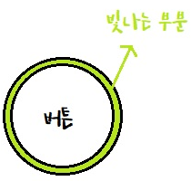

# jbnu-wp-team

2019년. 2학년 1학기. Windows Programming. 윈도우즈프로그래밍.

## 1. Development

### 1-1. Summary

C# 기반의 ***키보드 런치 패드(Keyboard Launch Pad)*** 윈도우 애플리케이션 개발.

### 1-2. Environment

C#, Visual Studio

## 2. Project Proposal

### 2-1. Project Name

키보드 런치 패드(Keyboard Launch Pad)

### 2-2. Team Info

김용현, 서민택, 이상승 (총 3명)

### 2-3. About the project

#### 2-3-1. 런치 패드(Launch Pad)란?

런치 패드(Launch Pad)라는 악기가 있습니다. 간략히 설명하면, 위 사진에서 보이는 동그라미 혹은 네모 버튼에 각각의 사운드 소스(Sound Source) 즉, 소리 음원을 할당한 후, 해당 버튼을 눌러 특정 소리를 내게 하는 악기입니다.

#### 2-3-2. 런치 패드(Launch Pad) 사용 목적

런치 패드는 크게 2가지 목적으로 사용됩니다.

첫째로, 음악 프로듀서들이 미디(MIDI) 혹은 시퀀싱(Sequencing) 작업을 할 때, 작업의 흐름을 좀 더 원할하고 용이하게 하기 위해 사용하는 경우입니다.

둘째로, 유튜브(Youtube)등의 동영상 플랫폼에서 자주 볼 수 있는 퍼포먼스(Performance) 용도로 사용하는 경우입니다.

저희는 프로그램을 개발할 때 전자보다 후자의 경우에 더 집중하였고, 편리하고 간단한 조작방법과 UI를 통하여 입문자분들도 쉽게 접근할 수 있게 하였습니다.

#### 2-3-3. 프로그램 개발 동기

키보드 런치 패드 프로그램 개발 동기에는 크게 2가지 이유가 있습니다.

첫째로, 비용 문제입니다. 이는 ***런치 패드 기기 자체***, 그리고 여기에 사용되는 사운드 소스를 관리하는 데 필요한 ***DAW***(Digital Audio Workstation, 음악 제작 편집 소프트웨어 프로그램)의 높은 가격대로 인해 발생합니다. ***런치 패드 기기 자체***의 가격은 약 20~40만원, 이를 관리하는 ***DAW*** 역시 약 30~80만원 선으로 높은 가격대를 형성합니다. 따라서, 런치 패드를 간단한 퍼포먼스 혹은 놀이, 오락의 개념으로 접근하고자 하는 분들에게 해당 가격대는 부담으로 다가올 수 있습니다.

둘째로, 어려운 조작 방법입니다. 런치 패드 하드웨어의 경우에는 악기 치고는 간단한 조작방법으로 별 문제가 없을 수 있지만, DAW의 경우에는 입문자 혹은 초보자분들이 접근하기에는 어려움이 있습니다. DAW의 런치 패드 소프트웨어의 사용 방법을 보면 상당히 복잡합니다. 이는 소프트웨어가 샘플러(Sampler)의 역할을 겸하고 있어, 파형을 편집하고 이펙터(Effector)를 사용할 수 있게 하는 다양한 노브(Knob) 및 파라미터(Parameter)들이 존재하기 때문입니다. 이러한 복잡성은 초보자나 입문자분들에게 진입장벽으로 작용할 수 있습니다. (아래 사진 참고)

#### 2-3-4. 프로그램 개요

위 내용들을 바탕으로 키보드 런치 패드(Keyboard Launch Pad) 프로그램을 구상하게 되었습니다. 이는 키보드의 버튼을 런치 패드의 버튼처럼 대신 사용하는 것으로, 키보드 버튼을 '타이핑'하거나 '좌클릭' 할 경우, 해당하는 소리가 하나씩 나게 해주는 프로그램입니다. 아래와 같은 3가지 부분을 큰 뼈대로 하여 세부 내용을 구현하였습니다.

1. 음악적 지식이 없는 초보자도 쉽게 이용할 수 있는 편리하고 직관적인 UI
2. 예쁜 외관 디자인과 퍼포먼스 용도로도 사용할 수 있는 화려한 UI
3. 놀이와 오락 퍼포먼스 용도에 적합한 정도의 꼭 필요한 기능들만 넣은 미니멀리즘

#### 2-3-5. 관련 프로그램/서비스 조사 결과

아래 프로그램들을 통해 BANK 기능, PLAY 기능 및 구조에 대한 아이디어를 얻었습니다.

Software

1. Native Instruments – Battery 4
2. Image Line – Drumaxx
3. Ableton Live – DrumSynth Abstract

Hardware

1. Novation – LaunchPad MK2
2. Native Instruments – MASCHINE MIKRO

#### 2-3-6. 개발 일정

- 2019년 5월 2주차 (5/07 ~ 5/12): 디자인 프로그래밍(XAML)
- 2019년 5월 3주차 (5/13 ~ 5/19): 구조 프로그래밍(C#)
- 2019년 5월 4주차 (5/20 ~ 5/26): 프로그램 버그 수정 및 완성도 점검
- 2019년 5월 5주차 (5/27 ~ 6/02): 발표준비

## 3. Requirements Specification

### 3-1. UI Design

UI 디자인은 크게 '레이아웃 디자인'과 '버튼 컬러 디자인'으로 나누어져 있습니다.

#### 3-1-1. 레이아웃 디자인

위 키보드 레이아웃과 같은 동글동글한 모양의 버튼들을 키보드 모양과 동일하게 배치합니다. 위 키보드 레이아웃의 행은 6개인데, 이 중 제일 위쪽 행은 'BANK' 기능, 가운데 4개의 행은 'PLAY' 기능, 제일 아래쪽 행은 'MENU' 기능으로 활용할 것입니다.

#### 3-1-2. 버튼 컬러 디자인

실제 런치패드의 경우, 버튼을 누르면 해당하는 버튼과 주위 버튼들이 예쁜 모양을 그리면서 빛나며, 이를 통해 화려한 시각적 효과가 나타납니다. 이와 같이 버튼 주위로 시각적 효과를 줄 수 있는 빛나는 부분을 만들어, 해당 버튼을 누를 때 마다 버튼이 반짝일 수 있도록 할 예정입니다.

### 3-2. Button Functions

UI의 모든 부분은 버튼으로 이루어져 있으며, 버튼을 'PLAY', 'BANK', 'MENU' 3가지 유형으로 분류하였습니다.

또한, 각각의 버튼은 '좌클릭', '우클릭', '키보드 타이핑' 3가지 이벤트에 따라 동작합니다.

#### 3-2-1. PLAY Button

PLAY 버튼의 가장 큰 역할은 '소리의 재생' 입니다.

1. 좌클릭 O

    해당 이벤트가 발생하면 '소리의 재생'이 이루어집니다. 여기서 재생되는 소리는 우리가 불러온 사운드 소스이며, 어떤 소스를 불러오고 사용할지는 우클릭 이벤트에서 고를 수 있습니다.

1. 우클릭 O

    해당 이벤트가 발생하면 '메뉴 버튼'이 등장합니다. 즉, 우클릭을 통한 메뉴 버튼으로 각각의 버튼을 관리할 수 있습니다.

    1. Load: 사운드 개별 소스 불러오기

        이 기능의 경우에는 'Drag & Drop' 기능으로도 구현할 예정입니다. 사용하고자 하는 사운드 소스가 있을 때, 해당 소스를 'Drag & Drop' 한 후 원하는 버튼으로 끌어오면 해당 소스가 별도의 Load 버튼 없이도 Load 됩니다.

    2. Save: 사운드 개별 소스 저장하기

    3. Check: 사운드 소스 파일명 확인하기

        이 기능의 경우에는 'Hovering' 기능으로도 구현할 예정입니다. 해당 버튼 위에 마우스를 갖다 댔을 때 어떤 사운드 소스를 이용하고 있나 바로 확인할 수 있습니다.

    4. Volume: 사운드 소스 볼륨 조절

    5. Panning: 사운드 소스 패닝(소리의 좌우 균형) 조절

    6. Color: 버튼 색상 변경 기능

1. 타이핑 O (해당 키를 타이핑 했을 때)

    좌클릭 이벤트와 동일합니다.

#### 3-2-2. BANK Button

BANK 버튼은 '소리 묶음의 저장' 역할을 합니다. 만약, Q라는 키에 A라는 소리가 저장되어 있으면, Q를 누르게 되면 항상 A라는 소리만 재생됩니다. 하지만, BANK를 이용하면 이는 상황에 따라 달라집니다. 1번 BANK의 Q에 A라는 소리를 저장해 두고, 2번 BANK의 Q에 B라는 소리를 저장해 둔 후, BANK만 바꿔준다면 A와 B라는 소리를 모두 Q라는 버튼을 통해 이용할 수 있습니다.

BANK 버튼에는 빛나는 부분은 없으며, 해당 버튼이 눌려있다는 표시만 할 것입니다.

1. 좌클릭 O

    BANK를 변경합니다. BANK는 12번까지 존재합니다.

1. ~~우클릭 X~~

1. 타이핑 O (해당 키를 타이핑 했을 때)

    좌클릭 이벤트와 동일합니다.

#### 3-2-3. MENU Button

MENU 버튼에는 'Stop', 'Repeat', 'Record' 3가지 기능이 있습니다.

1. 좌클릭 O

    1. Stop: 재생중인 모든 소리의 정지

    1. Repeat: 반복 재생 기능

    1. Record: 소리 녹음 기능

1. ~~우클릭 X~~

1. 타이핑 O (해당 키를 타이핑 했을 때)

    좌클릭 이벤트와 동일합니다.

### 3-3. Other Functions

#### 3-3-1. API 연동

1. SoundCloud 연동을 통하여 내가 만든 음원을 조금 더 쉽게 공유하고, 런치 패드를 사용할때 필요한 음원들을 더 쉽게 참고할 수 있게 합니다.

2. 음원탐색 사이트인 BEATPORT를 통하여 EDM 계열 음악을 더 쉽게 탐색할 수 있게 합니다.
